# Laboratorio de Estatistica - Video Game Sales

Trabalho da disciplina de Matematica e Estatistica.

| | |
|---|---|
| **Aluno** | Arthur Morais de Carvalho Rocha |
| **Matricula** | 72650520 |

Escolhi um dataset real de vendas de jogos de video game e criei uma
aplicacao onde da para explorar os dados de forma interativa. **Todas as contas
de estatistica foram escritas por mim**, do zero, a partir das formulas - o
NumPy e o SciPy sao usados apenas nos testes, para conferir se as minhas contas
estao certas.

## A aplicacao funcionando

### Modulo 0 - Os dados
16.598 jogos, com o dicionario de cada coluna e o levantamento de valores faltando.

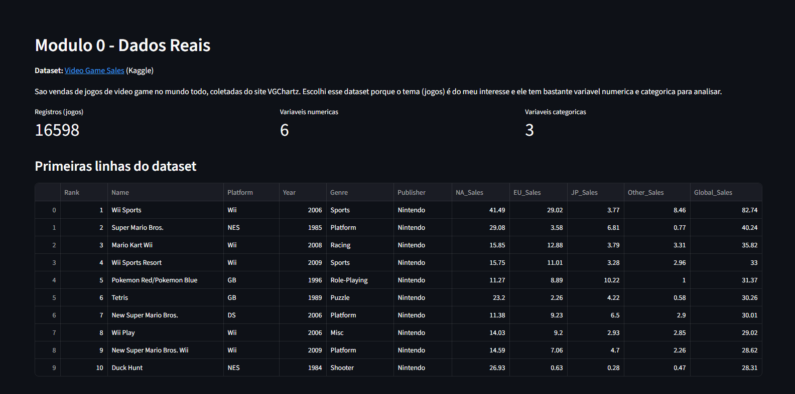

### Modulo 2 - Estatistica Descritiva
Medidas de tendencia central, dispersao e quartis, todas calculadas pelo
`minhastats.py`, mais a interpretacao escrita automaticamente.

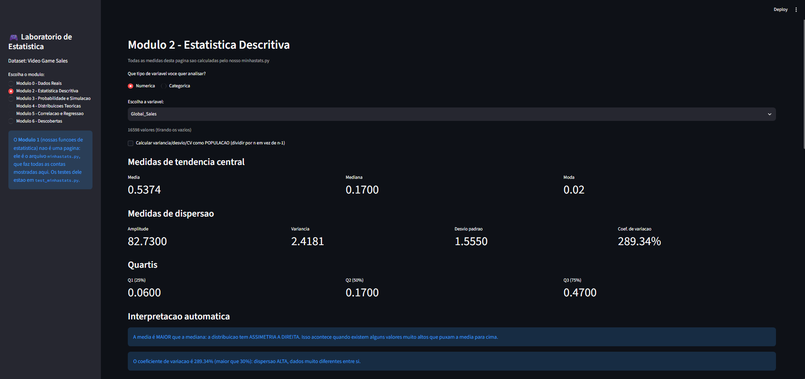

Histograma e boxplot (aqui da variavel `Year`):

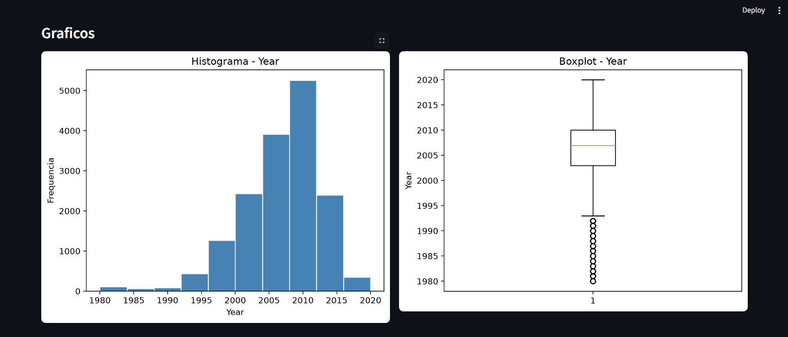

Para variaveis categoricas, barras e pizza:

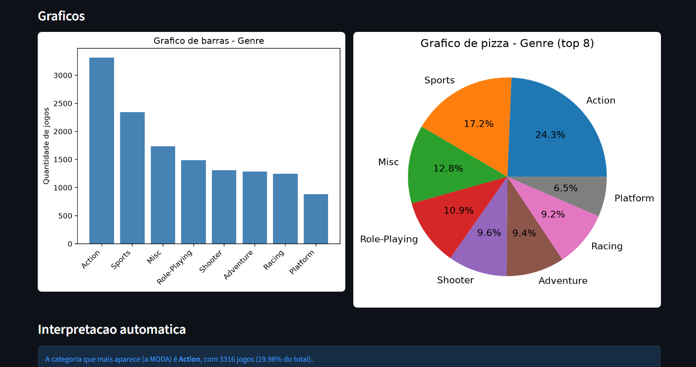

Deteccao de outliers pela regra do IQR:

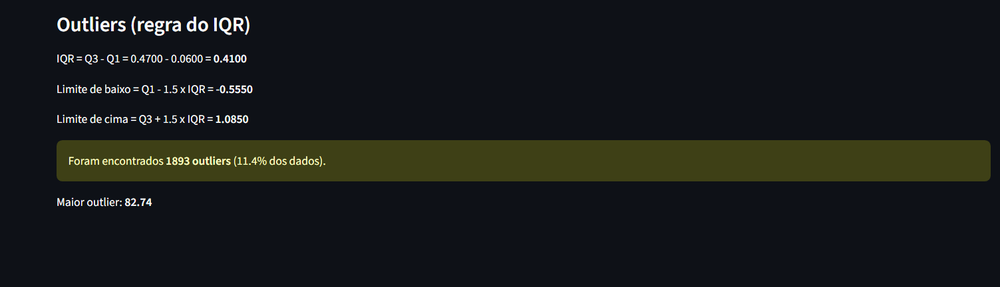

### Modulo 3 - Simulacao de Monte Carlo
Lei dos Grandes Numeros: a frequencia relativa converge para a probabilidade teorica.

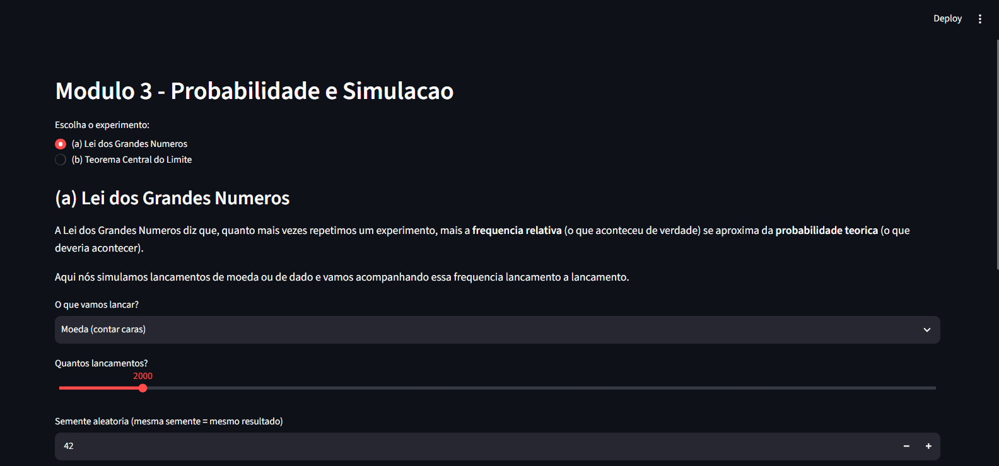

Teorema Central do Limite: a distribuicao das medias amostrais.

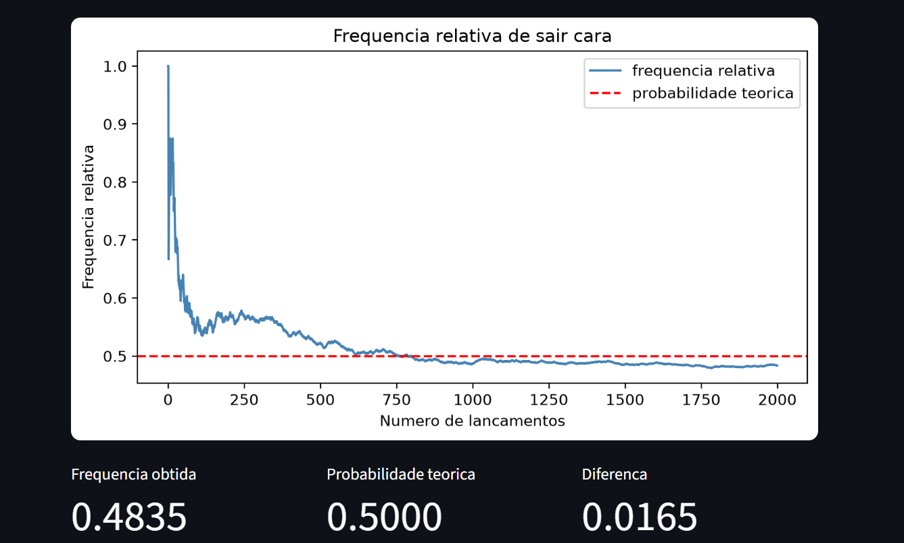

### Modulo 4 - Distribuicoes Teoricas
Curvas teoricas sobrepostas ao histograma, com parametros estimados dos dados.

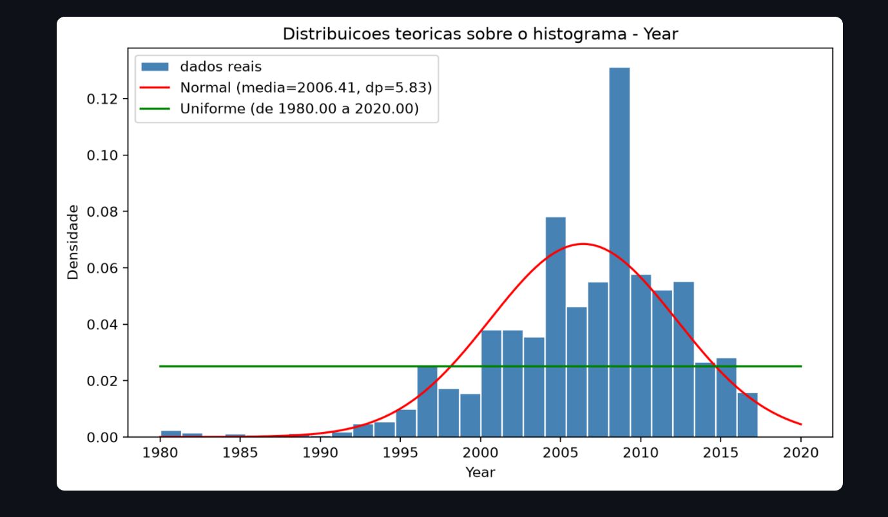

### Modulo 5 - Correlacao e Regressao
Correlacao de Pearson, R² e a reta de minimos quadrados.

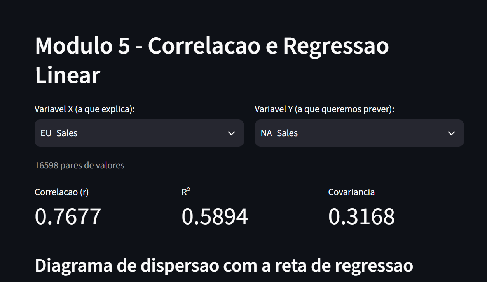

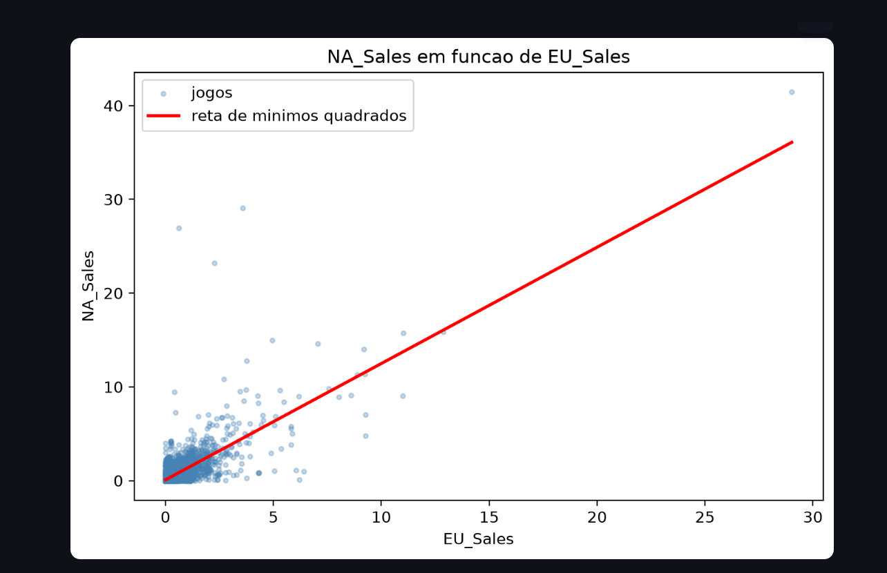

### Modulo 6 - As 3 descobertas
Recalculadas ao vivo pela biblioteca a cada carregamento da pagina.

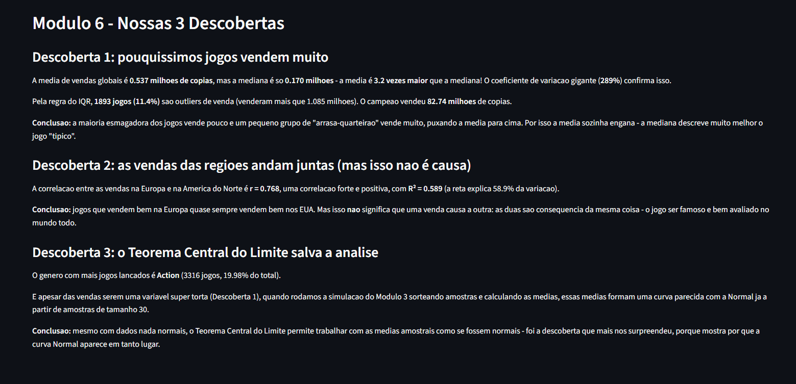

### Os testes
Os 38 testes comparando cada funcao propria com NumPy/SciPy.

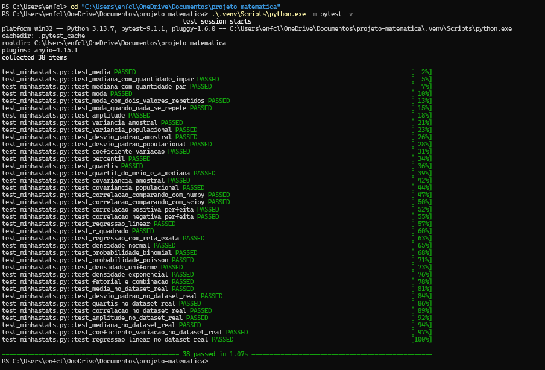

## Arquivos do projeto

| Arquivo | O que é |
|---|---|
| `minhastats.py` | **Modulo 1** - nossa biblioteca de estatistica (todas as formulas) |
| `test_minhastats.py` | Testes automatizados comparando nossas funcoes com NumPy/SciPy |
| `app.py` | A aplicacao (Modulos 0, 2, 3, 4, 5 e 6) |
| `data/vgsales.csv` | O dataset (16.598 jogos) |
| `RELATORIO.md` | Relatorio com as formulas, as decisoes e as 3 descobertas |
| `requirements.txt` | Lista de bibliotecas necessarias |

## O dataset

[Video Game Sales](https://www.kaggle.com/datasets/gregorut/videogamesales) (publicado no Kaggle pelo usuario gregorut) - vendas de jogos, resultado de
uma raspagem do site VGChartz. Baixamos o CSV de um espelho publico no GitHub
(o Kaggle exige login para baixar direto), entao os numeros sao os mesmos, so
a forma de baixar que foi diferente. Importante: como vem do VGChartz, sao
**estimativas** de vendas, nao numeros oficiais divulgados pelas publicadoras.

- **16.598 registros** (jogos)
- **6 variaveis numericas:** `Year`, `NA_Sales`, `EU_Sales`, `JP_Sales`, `Other_Sales`, `Global_Sales`
- **3 variaveis categoricas:** `Platform`, `Genre`, `Publisher`

O arquivo ja esta na pasta `data/`, nao precisa baixar nada.

## Como rodar

Precisa ter o **Python 3.10 ou mais novo** instalado.

**1. Baixar o projeto**

```bash
git clone <link-do-repositorio>
cd projeto-matematica
```

**2. Criar o ambiente virtual e ativar**

```bash
python -m venv .venv
```

No Windows (PowerShell):
```bash
.venv\Scripts\Activate.ps1
```

No Linux ou Mac:
```bash
source .venv/bin/activate
```

**3. Instalar as bibliotecas**

```bash
pip install -r requirements.txt
```

**4. Abrir a aplicacao**

```bash
streamlit run app.py
```

O navegador abre sozinho em `http://localhost:8501`. Use o menu da esquerda
para trocar de modulo.

## Como rodar os testes

```bash
pytest -v
```

Sao 38 testes. Cada um pega uma funcao nossa, faz a mesma conta com NumPy ou
SciPy e confere se o resultado bate (a diferenca tem que ser menor que
0,0000000001). Se todos passarem, nossas formulas estao corretas.

## O que tem em cada modulo

- **Modulo 0 - Dados Reais:** apresenta o dataset, explica cada coluna e mostra onde faltam dados.
- **Modulo 1 - Nossas funcoes:** é o arquivo `minhastats.py` (media, mediana, moda, amplitude,
  variancia, desvio padrao, quartis, percentis, coeficiente de variacao, covariancia,
  correlacao de Pearson, regressao linear e as distribuicoes teoricas).
- **Modulo 2 - Estatistica Descritiva:** escolhe uma variavel e mostra a tabela de frequencias,
  todas as medidas, histograma, boxplot (ou barras e pizza, se for categorica), os outliers
  pela regra do IQR e uma interpretacao escrita automaticamente.
- **Modulo 3 - Probabilidade e Simulacao:** simulacao de Monte Carlo da Lei dos Grandes Numeros
  (moeda e dado) e do Teorema Central do Limite (medias de amostras do dataset).
- **Modulo 4 - Distribuicoes Teoricas:** coloca a curva Normal e mais uma curva (Exponencial ou
  Uniforme) por cima do histograma, com os parametros estimados dos proprios dados.
- **Modulo 5 - Correlacao e Regressao:** escolhe duas variaveis e mostra o grafico de dispersao,
  a correlacao, a reta de minimos quadrados, a equacao, o R² e um campo para fazer previsoes.
- **Modulo 6 - Descobertas:** as 3 coisas mais interessantes que descobrimos.

## Regra de ouro

O pandas so é usado para **ler o CSV e filtrar as colunas**. Toda medida que
aparece na tela (media, mediana, variancia, correlacao, coeficientes da reta...)
é calculada pelas funcoes do `minhastats.py`, que foram escritas por nós e
validadas nos testes.
